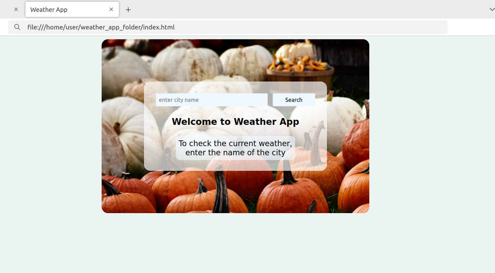

## Weather App

### Project Description

This web application allows users to check the current weather in the city specified by the user in the input field. For better visual representation, it also displays an image relevant to the request. This app was created for the purpose of practicing with APIs.

### Requirements

To run this app you will need:
* An Openweathermap API key, which you can obtain by registering a **free account** on their website: https://home.openweathermap.org/users/sign_up.
> [!IMPORTANT]
> This step is vital for this weather application to work.
* An Unsplash API key. To get one, go to the Unsplash website https://unsplash.com, register a **free account**, log in, then go to the application dashboard and click "New Application".
> [!NOTE]
> This step is optional as it allows you to fetch images for the application background. In case you didn't get an image API key, the default background will be set.
* Installed and recently updated one of the popular web browsers such as Chrome, Edge, Safari, Firefox, Opera (except Opera Mini), etc.

### How to run

1. Download *config.js, index.html, script.js,* and *style.css* files from this repository.
2. Open the "config.js" file in your favourite text editor and put your Openweathermap API and Unsplash API keys into the quotes. Save the changes.
3. Open the *index.html* file in your web browser:
   - right click on the "index.html" file;
   - in a pop-up menu select "open with Name-Of-Your-Browser";
   - If you followed all the requirements above, then in the browser window that opens, you must see the "Weather app" web interface:

4. Enter the name of the city you want to check the weather in into the input field and click the "Search" button or press Enter.
5. As a result, you should see information about the current weather in the requested city:

6. Well done!
> [!NOTE]
> To successfully run "Weather App" program, keep all files of this package in the same directory.
